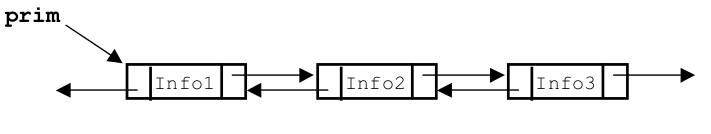

# Mini Projeto I - Lista Duplamente Encadeada

Implementação de uma lista duplamente encadeada em Java. Projeto desenvolvido como requisito parcial para conclusão na disciplina de Estruturas de Dados e Algoritmos 2020.1.
